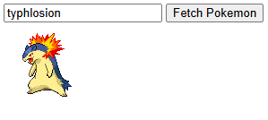

# Pokemon Sprite Viewer

A simple web application that allows users to search for and display Pokemon sprites using the PokeAPI. This project demonstrates basic API integration and asynchronous JavaScript functionality.



## Features

- Search Pokemon by name
- Display Pokemon sprites dynamically
- Error handling for failed API requests
- Responsive design for various screen sizes

## Technology Stack

- HTML5
- CSS3
- JavaScript
- [PokeAPI](https://pokeapi.co/) - A RESTful Pokemon API

## How It Works

The application makes asynchronous requests to the PokeAPI to fetch Pokemon data. When a user enters a Pokemon name and clicks the "Fetch Pokemon" button, the application:

1. Converts the input to lowercase to match the API's requirements
2. Sends a request to `https://pokeapi.co/api/v2/pokemon/{pokemon-name}`
3. Retrieves the Pokemon's sprite URL from the response
4. Updates the image element to display the sprite

As shown in the demo image above, entering "typhlosion" displays the fire-type Pokemon's sprite.

## Code Structure

- `index.html`: Contains the basic structure and UI elements
- `index.js`: Handles the API integration and DOM manipulation
- `styles.css`: Manages the application's visual styling

## Usage

1. Clone the repository:

```bash
git clone [repository-url]
```

2. Open `index.html` in your web browser

3. Enter a Pokemon name (e.g., "pikachu", "charizard", "typhlosion")

4. Click "Fetch Pokemon" to display the sprite

## Error Handling

The application includes robust error handling:

- Invalid Pokemon names trigger an error message in the console
- Network errors are caught and logged
- The UI provides visual feedback for loading states

## API Limitations

- The PokeAPI has rate limiting in place
- Pokemon names must be spelled correctly
- Some Pokemon may have multiple sprite variations

## Acknowledgments

- Thanks to the [PokeAPI](https://pokeapi.co/) team for providing the Pokemon data
